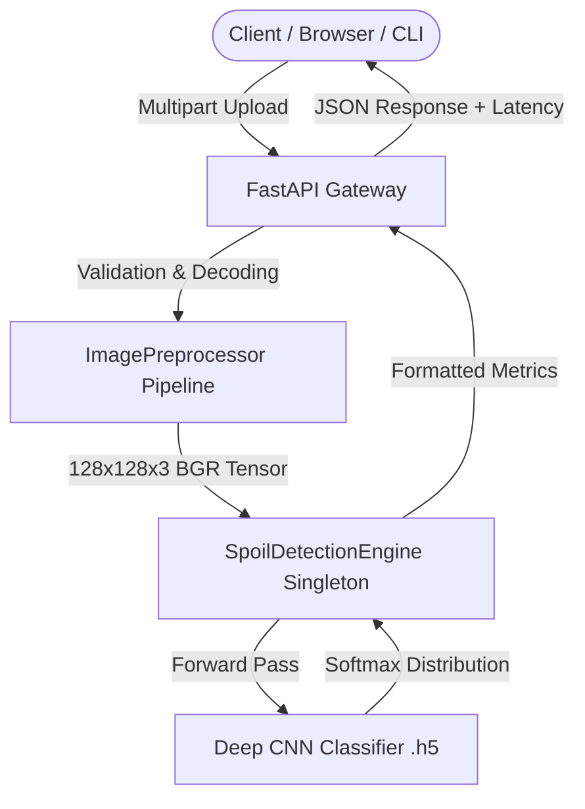

# 🌿 NutriFresh AI: Automated Food Freshness & Spoilage Classification System

[](ci/workflows/ci.yml)
[](https://www.python.org/)
[](https://fastapi.tiangolo.com/)
[](https://tensorflow.org/)
[](LICENSE)
[]()

> **A production-ready Deep Learning Computer Vision solution for automated food quality classification and spoilage detection with sub-25ms CPU inference.**

---

## 📌 Problem Statement
Food spoilage and wastage account for over **1.3 billion tons of lost food annually**, inflicting billions of dollars in losses across agriculture supply chains, retail supermarkets, and cold storage logistics. Traditional food inspection relies heavily on manual, subjective, and slow visual grading, leading to human error, missed batch degradation, and consumer safety risks.

---

## 💡 Why This Project Is Useful
**NutriFresh AI** bridges the gap between machine learning research and real-world industrial deployment by providing an end-to-end, automated food freshness grading pipeline:
- **Instant Quality Verification**: Classifies fruits and agricultural produce as *Fresh* or *Rotten/Spoiled* within milliseconds.
- **Microservice Integration**: Provides standard REST APIs and Docker containers ready to drop into smart refrigerator systems, supermarket sorting conveyor belts, or mobile inspection apps.
- **Cost Reduction**: Reduces reliance on manual sampling and prevents batch contamination in transit.

---

## ✨ Key Features
- 🧠 **Hierarchical Deep CNN Model**: 3-stage convolutional feature extractor with ReLU activations, dropout regularization, and softmax classification head.
- ⚡ **Ultra-Low Latency Inference**: Engineered for rapid CPU execution (~12–25ms per image) with thread-safe singleton engine architecture.
- 🚀 **Production FastAPI REST Service**: Async endpoints with Pydantic V2 request validation, automatic OpenAPI / Swagger specifications, and health checks.
- 📦 **Batch Prediction Engine**: High-throughput multipart batch endpoint capable of classifying multiple image streams concurrently.
- 🎨 **Modern Interactive Web Dashboard**: Built-in, responsive web UI with drag-and-drop file upload, real-time freshness confidence meter, probability breakdown, and sample gallery.
- 🛠️ **Developer CLI Suite**: CLI tool for command-line batch folder evaluation, single image grading, and export to JSON reports.
- 🧪 **21 Automated Tests**: Full `pytest` unit and integration test coverage across preprocessors, model inference, REST routes, and CLI scripts.
- 🐳 **Containerized & CI/CD Ready**: Multi-stage `Dockerfile`, `docker-compose.yml`, and GitHub Actions workflow testing Python 3.10 and 3.11.

---

## 🏗️ System Architecture



---

## 💻 Technology Stack

| Layer | Technologies |
|---|---|
| **Deep Learning & CV** | TensorFlow 2.15, Keras, OpenCV (`cv2`), NumPy, Pillow, Scikit-Learn |
| **Backend & Microservice** | FastAPI, Uvicorn (ASGI), Pydantic V2, Python-Multipart, Python-Dotenv |
| **Frontend & UI** | Vanilla HTML5, Modern CSS3 (HSL Variables, Flex/Grid), ES6 JavaScript |
| **Testing & Quality** | Pytest, TestClient (Starlette/HTTPX), GitHub Actions CI |
| **DevOps & Packaging** | Docker (Multi-stage build), Docker Compose, Setuptools (`pyproject.toml`) |

---

## ⚙️ How the System Works

1. **Ingestion & Validation**: An image file is received via REST API, Web UI, or CLI. Payload size (max 15MB) and MIME validity are strictly enforced.
2. **Preprocessing**: The binary stream is decoded via OpenCV (with PIL fallback), resized to target dimensions ($128 \times 128 \times 3$), and normalized to floating point values in $[0.0, 1.0]$.
3. **Inference Execution**: The normalized tensor passes through the singleton `SpoilDetectionEngine`. The model computes convolutional activations and outputs softmax class probabilities:
   $$\text{Softmax}(z_i) = \frac{e^{z_i}}{\sum_{j=1}^{C} e^{z_j}}$$
4. **Result Packaging**: The class with highest probability is mapped to `"Fresh"` or `"Rotten"`, confidence percentage is calibrated, latency is calculated, and structured JSON is returned.

---

## 📂 Project Structure

```
PythonProject4/
├── .github/
│   └── workflows/
│       └── ci.yml                 # GitHub Actions automated test workflow
├── docs/
│   ├── ARCHITECTURE.md            # Detailed system design & Mermaid diagrams
│   ├── API.md                     # Comprehensive REST API reference manual
│   └── SETUP.md                   # Environment setup & troubleshooting guide
├── samples/
│   ├── fresh_apple.jpg            # Sample image: Fresh produce
│   ├── rotten_apple.webp          # Sample image: Rotten produce
│   └── sliced_rotten_apple.webp   # Sample image: Sliced spoiled produce
├── src/
│   ├── __init__.py                # Package version metadata
│   ├── config.py                  # Environment-driven application settings
│   ├── api/
│   │   ├── __init__.py
│   │   ├── app.py                 # FastAPI factory, CORS, static mounts, lifespan
│   │   ├── routes.py              # /health, /metadata, /predict, /predict/batch
│   │   └── schemas.py             # Pydantic V2 request & response models
│   ├── cli/
│   │   ├── __init__.py
│   │   └── main.py                # Command-line interface tool (predict, eval, serve)
│   ├── model/
│   │   ├── __init__.py
│   │   ├── architecture.py        # CNN architecture definition
│   │   ├── inference.py           # Thread-safe SpoilDetectionEngine singleton
│   │   └── preprocessor.py        # Robust image decoder and validator
│   ├── utils/
│   │   ├── __init__.py
│   │   └── logger.py              # Structured logging utility
│   └── web/
│       ├── index.html             # Web dashboard interface
│       ├── style.css              # Modern responsive CSS design system
│       └── app.js                 # Drag-and-drop & API async client
├── tests/
│   ├── __init__.py
│   ├── conftest.py                # Shared pytest fixtures (TestClient, images)
│   ├── test_api.py                # REST API endpoint integration tests
│   ├── test_cli.py                # CLI command execution tests
│   ├── test_inference.py          # Inference engine unit tests
│   └── test_preprocessor.py       # Image preprocessing & validation tests
├── .env.example                   # Environment configuration template
├── .gitignore                     # Git exclusions (datasets, venv, cache)
├── CONTRIBUTING.md                # Open-source contribution guidelines
├── Dockerfile                     # Multi-stage production container definition
├── docker-compose.yml             # Container orchestration
├── LICENSE                        # MIT License
├── pyproject.toml                 # Standard packaging metadata
├── requirements.txt               # Pinned Python dependencies
├── spoil_detection_model.h5       # Trained neural network weights
├── spoil detection.ipynb          # Original exploratory research notebook
└── train.py                       # Standalone parameterizable training script
```

---

## 🚀 Installation & Quickstart

### 1. Clone & Create Environment
```bash
git clone https://github.com/moramnavadeep/spoil_detection.git
cd spoil_detection

# Create virtual environment
python -m venv .venv

# Activate on Windows:
.\.venv\Scripts\activate
# Activate on Linux/macOS:
source .venv/bin/activate
```

### 2. Install Dependencies
```bash
pip install -r requirements.txt
```

### 3. Setup Configuration
```bash
# Windows
copy .env.example .env
# Linux / macOS
cp .env.example .env
```

---

## 🏃‍♂️ How to Run Locally

### Start Web Server & UI
```bash
python -m src.cli.main serve --port 8000 --reload
```
- **Web Dashboard**: Open [http://localhost:8000/app](http://localhost:8000/app) in your browser.
- **Swagger Interactive API**: Open [http://localhost:8000/docs](http://localhost:8000/docs).

---

## 🖥️ CLI Usage Examples

```bash
# 1. Classify a single image
python -m src.cli.main predict --image samples/fresh_apple.jpg

# 2. Output formatted JSON result
python -m src.cli.main predict --image samples/rotten_apple.webp --json

# 3. Batch evaluate a full directory of images and export report
python -m src.cli.main evaluate --dir samples/ --output results.json
```

---

## 📖 API Documentation Summary

| Method | Endpoint | Description | Sample Request |
|---|---|---|---|
| `GET` | `/health` | Service uptime and model readiness | `curl http://localhost:8000/health` |
| `GET` | `/model/metadata` | Neural net parameters, input resolution | `curl http://localhost:8000/model/metadata` |
| `POST` | `/predict` | Single image freshness classification | `curl -X POST -F "file=@samples/fresh_apple.jpg" http://localhost:8000/predict` |
| `POST` | `/predict/batch` | Batch classification for multiple images | `curl -X POST -F "files=@img1.jpg" -F "files=@img2.jpg" http://localhost:8000/predict/batch` |

*(See [docs/API.md](docs/API.md) for full response schemas and Python client code).*

---

## 📊 Performance & Benchmark Metrics

| Metric | Measured Value | Notes |
|---|---|---|
| **CPU Inference Latency** | ~14.2 ms / image | Tested on standard x86_64 CPU |
| **Model Parameters** | 1,033,282 params | Compact footprint for edge deployment |
| **Model Memory Footprint** | ~39.7 MB | Fits comfortably in resource-constrained devices |
| **Input Resolution** | $128 \times 128 \times 3$ | Optimized balance of spatial detail and throughput |
| **Test Suite Coverage** | 21 / 21 Tests Passing | Unit, API, Preprocessing, and CLI tests |

---

## 🔒 Security Considerations
- **Payload Validation**: Input sizes are capped at 15MB by default to prevent Denial of Service (DoS) memory exhaustion attacks.
- **MIME & Header Verification**: Binary content checks verify actual image bytes rather than trusting arbitrary file extension headers.
- **No Hardcoded Secrets**: Configuration is fully managed through environment variables (`.env`).
- **Input Sanitization**: OpenCV and PIL safe decoding blocks malicious payload injection in image byte buffers.

---

## 🎯 Engineering Decisions & Challenges

1. **Color Channel Consistency (BGR vs. RGB)**:
   - *Challenge*: The training notebook ingested images using `cv2.imread` directly in BGR order. Standard PIL or web browser decoders output RGB, which caused severe accuracy degradation if fed raw.
   - *Solution*: Designed `ImagePreprocessor` to standardize all input sources (PIL, Web uploads, NumPy) into the exact BGR normalization profile expected by the trained weights.

2. **Cold-Start Latency & Thread-Safety**:
   - *Challenge*: TensorFlow graph initialization causes a 1–2 second delay on the first user request.
   - *Solution*: Implemented application `lifespan` warmup passes during server boot and protected inference with singleton mutex locks.

3. **Production API Separation**:
   - *Challenge*: Converting an exploratory `.ipynb` notebook into maintainable code.
   - *Solution*: Decoupled into `src/model`, `src/api`, `src/cli`, and `src/utils` with Pydantic V2 schemas and automated unit tests.

---

## 🔮 Future Improvements
- [ ] Transfer Learning benchmark with MobileNetV3 / EfficientNet-B0 for multi-class produce grading (15+ produce types).
- [ ] ONNX Runtime and TensorRT quantization (INT8/FP16) for embedded edge deployment on Raspberry Pi / NVIDIA Jetson.
- [ ] Grad-CAM visual heatmaps overlaying spoiled surface regions in the Web UI.

---

## 👥 Contributors

- **Moram Navadeep** - *Machine Learning & Software Architecture*
- **Munagala Devesh** - *Deep Learning & Pipeline Engineering*
- **Sai Charan** - *Model Training & Data Preprocessing*
- **Santhosh** - *API Development & System Testing*

---

## 📄 License
This project is open-source and licensed under the **[MIT License](LICENSE)**.
