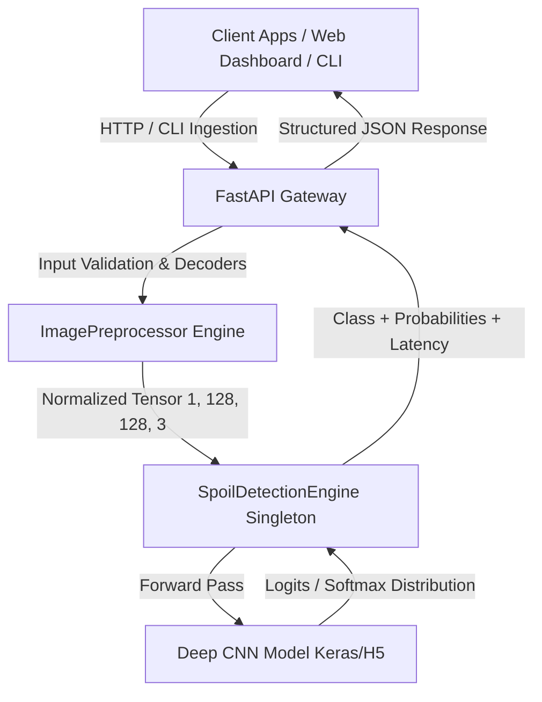

# System Architecture & Technical Design

## Overview

**NutriFresh AI** is structured using a **Clean Layered Architecture**, separating computer vision preprocessing, deep neural network inference, web microservices, and client interfaces into decoupled, testable components.

---

## Component Breakdown

### 1. Neural Network Architecture (`src/model/architecture.py`)
The food freshness detection network is a hierarchical Convolutional Neural Network designed for spatial feature extraction with regularized classification:

```mermaid
flowchart LR
    Input[Input Image 128x128x3] --> Conv1[Conv2D 32, 3x3 + ReLU]
    Conv1 --> Pool1[MaxPooling2D 2x2]
    Pool1 --> Conv2[Conv2D 64, 3x3 + ReLU]
    Conv2 --> Pool2[MaxPooling2D 2x2]
    Pool2 --> Conv3[Conv2D 128, 3x3 + ReLU]
    Conv3 --> Pool3[MaxPooling2D 2x2]
    Pool3 --> Flatten[Flatten Layer]
    Flatten --> Dense1[Dense 128 + ReLU]
    Dense1 --> Drop[Dropout 0.5]
    Drop --> Out[Dense 2 Softmax Output]
```

- **Feature Extraction**: 3 consecutive Conv2D-MaxPool stages extract hierarchical low-level textures, mid-level discoloration spots, and high-level structural degradation indicators.
- **Regularization**: 50% dropout before the classification head prevents overfitting to background artifacts in agricultural dataset captures.
- **Output Head**: Softmax cross-entropy producing probability distributions across `["Fresh", "Rotten"]`.

---

### 2. Preprocessing & Validation Pipeline (`src/model/preprocessor.py`)
- **Safety Checks**: Validates binary file headers, MIME types, and maximum payload constraints (default 15MB).
- **Dual Decoding Path**: OpenCV `imdecode` with fallback to PIL `Image.open` for broad container compatibility (JPEG, PNG, WEBP, BMP).
- **Geometric Normalization**: Standardized interpolation (`INTER_AREA`) resizing to 128×128.
- **Color Calibration**: BGR color channel alignment and [0, 1] floating-point pixel rescaling to match training distribution.

---

### 3. Inference Engine (`src/model/inference.py`)
- **Singleton Pattern**: Prevents redundant model deserialization across concurrent worker threads.
- **Warmup Forward Pass**: Executes a synthetic inference cycle during application boot to avoid cold-start latency spikes.
- **Thread Safety**: Mutex locks during model inference passes ensure safety under multi-threaded server workers.
- **Telemetry**: Measures end-to-end CPU inference latency (typically 12–25ms).

---

### 4. API & Microservice Layer (`src/api/`)
- Built on **FastAPI** leveraging Starlette's asynchronous I/O and Pydantic V2 data validation.
- OpenAPI 3.0 auto-generated interactive documentation at `/docs`.
- Standardized error handling returning structured JSON envelopes for client robustness.
